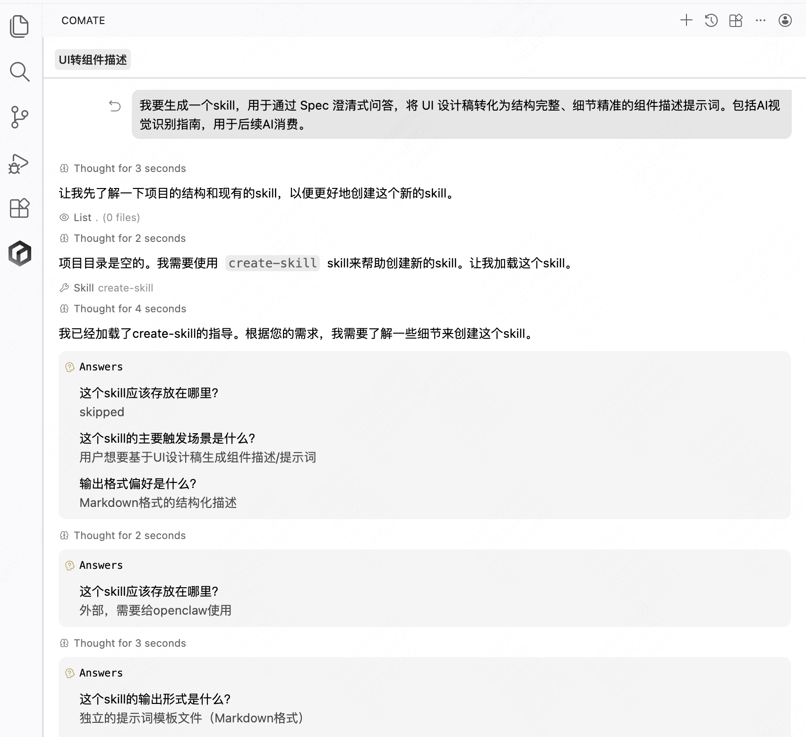
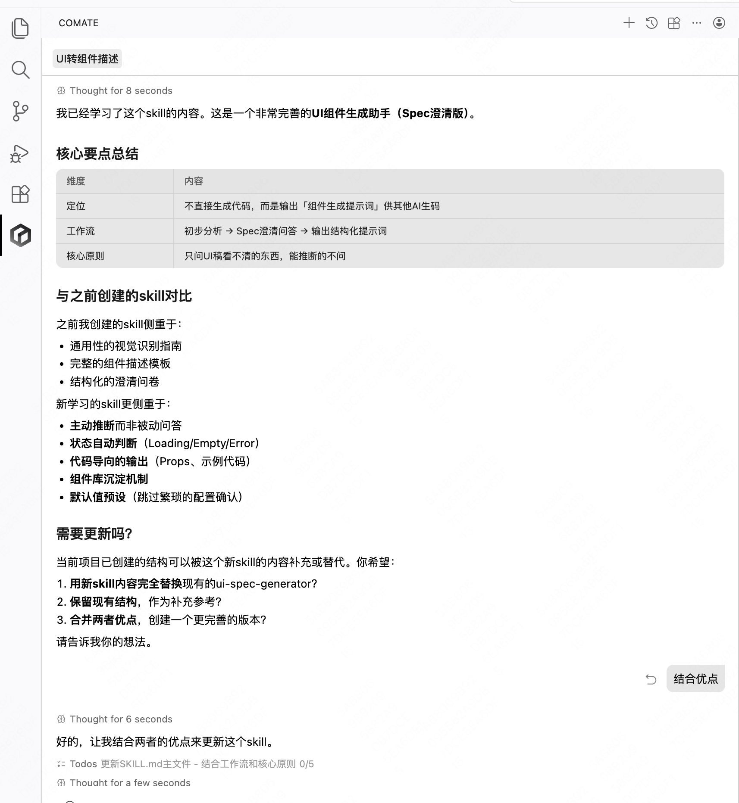
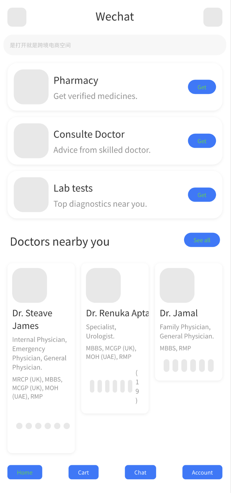
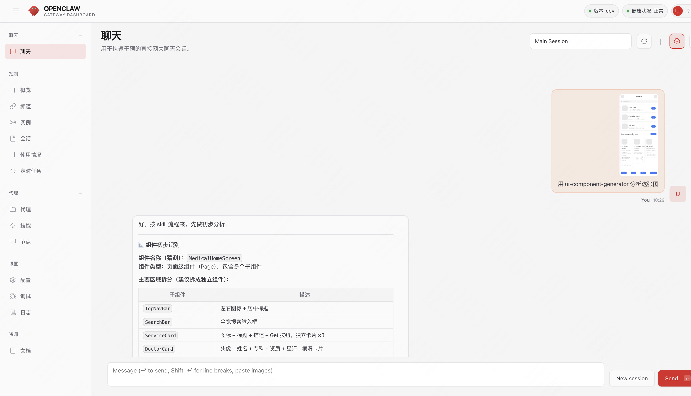
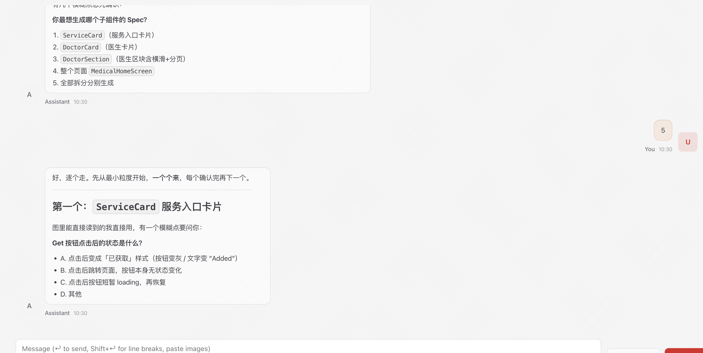
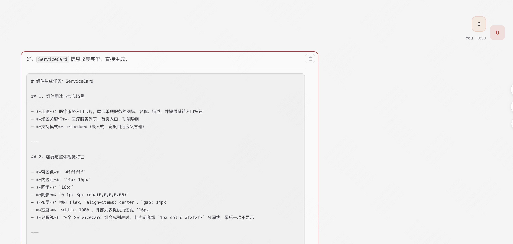

# UI 组件生成助手

通过 Spec 澄清式问答，将 UI 设计稿转化为结构完整、细节精准的**组件描述提示词**。包括AI视觉识别指南，用于后续AI消费。

## 是什么

拿到一张 UI 稿图片，这个 Skill 会：

1. **初步识别**：分析组件类型、区域结构、可能存在的状态（Loading / Empty / Error 等）
2. **Spec 澄清**：只针对图里看不清的细节逐一提问（文本截断规则、交互行为、动效、布局方式等）
3. **输出提示词**：生成一份覆盖视觉、交互、状态、动效、Props、标签的完整组件 Spec

> 本 Skill 只输出**组件描述提示词**，不直接生成代码。

## 触发方式

- 发送 UI 设计稿图片 + "生成组件" / "帮我写组件"
- "帮我澄清这个组件的 Spec"
- "根据 UI 稿生成组件提示词"

## 输出内容

生成的提示词包含以下章节：

| 章节 | 内容 |
|------|------|
| 组件用途与核心场景 | 功能描述、使用场景、布局模式 |
| 容器与整体视觉特征 | 背景色、内边距、圆角、阴影 |
| 区域结构与视觉规范 | 头部 / 内容区 / 底部的详细描述 |
| 文字排版细节 | 字号、行高、字重、颜色、换行规则 |
| 交互行为 | 点击、悬停、内部操作 |
| 状态定义 | Default / Loading / Streaming / Empty / Error |
| 动画与动效 | 入场动画、骨架屏、打字机效果等 |
| Props 接口 | TypeScript 类型定义 |
| 组件标签 | 类型、业务场景、交互特征、技术栈、视觉风格 |
| 使用示例 | 典型用法代码片段 |
| AI 识别指南 | 视觉识别信号、结构特征，供 AI 复用匹配 |
| 代码要求 | 类型安全、状态完整、动效实现等规范 |

## 问答原则

- 能从图里直接读出来的（颜色、字号、间距）→ 直接写入，不问
- 有合理默认值的 → 直接用，不问
- 模糊、有歧义、静态图无法表达的 → 才问，且每次只问一个

## 快捷指令

| 指令 | 效果 |
|------|------|
| 跳过 | 跳过当前问题，使用默认值 |
| 全部默认 | 跳过剩余问题，直接生成 |
| 直接生成 | 用已有信息立即输出（模糊部分标注 `{待确认}`） |

## 组件库沉淀

每次生成完提示词后，会自动保存到 `components/{ComponentName}.md`，供后续 AI 通过标签和视觉信号匹配复用。


## 制作过程
初始化

还能取其精华去其糟粕



## 示例
- UI原型图：


- 小龙虾使用案例：





- 输出结果：
# 组件生成任务：ServiceCard

## 1. 组件用途与核心场景

- **用途**：医疗服务入口卡片，展示单项服务的图标、名称、描述，并提供跳转入口按钮
- **场景关键词**：医疗服务列表、首页入口、功能导航
- **支持模式**：embedded（嵌入式，宽度自适应父容器）

---

## 2. 容器与整体视觉特征

- **背景色**：`#ffffff`
- **内边距**：`14px 16px`
- **圆角**：`16px`
- **阴影**：`0 1px 3px rgba(0,0,0,0.06)`
- **布局**：横向 Flex，`align-items: center`，`gap: 14px`
- **宽度**：`width: 100%`，外部列表提供页边距 `16px`
- **分隔线**：多个 ServiceCard 组合成列表时，卡片间底部 `1px solid #f2f2f7` 分隔线，最后一项不显示

---

## 3. 区域结构与视觉规范

### 3.1 左侧图标区
- 尺寸：`64×64px`
- 背景：`#e9e9eb`（占位色，实际为图片）
- 圆角：`14px`
- `flex-shrink: 0`

### 3.2 中间文字区
- `flex: 1`，纵向排列，`gap: 4px`
- 服务名称：`17px`，`font-weight: 600`，`color: #1c1c1e`，超长单行省略
- 服务描述：`13px`，`font-weight: 400`，`color: #8e8e93`，超长单行省略

### 3.3 右侧按钮区
- 蓝色胶囊按钮，`background: #3a7bfd`
- 文字：`"Get"`，`14px`，`font-weight: 500`，`color: #ffffff`
- 内边距：`8px 20px`
- 圆角：`20px`（全圆）
- 点击后直接触发 `onClick` 回调，无按钮内部状态变化
- Active 态：`opacity: 0.8`，`transition: opacity 150ms`

---

## 4. 文字排版细节

| 层级 | 字号 | 字重 | 颜色 | 截断规则 |
|------|------|------|------|----------|
| 服务名称 | `17px` | `600` | `#1c1c1e` | 单行省略 `text-overflow: ellipsis` |
| 服务描述 | `13px` | `400` | `#8e8e93` | 单行省略 `text-overflow: ellipsis` |
| 按钮文字 | `14px` | `500` | `#ffffff` | 不截断，`white-space: nowrap` |

---

## 5. 交互行为

- 整体卡片：不可点击（仅按钮可点击）
- Get 按钮点击：触发 `onGetClick` 回调，跳转由父组件控制，按钮自身无状态变化
- Get 按钮 Active 态：`opacity: 0.8`，`transition: 150ms`

---

## 6. 状态定义

| 状态 | 触发条件 | 视觉表现 |
|------|----------|----------|
| Default | 正常展示 | 如上描述 |
| Loading | 数据加载中 | 骨架屏：图标区灰色矩形占位，标题区宽60%灰条，描述区宽80%灰条，按钮区灰色圆角矩形占位，pulse动画 |
| Empty | 无数据传入 | 组件不渲染（返回 null） |
| Error | 数据加载失败 | 图标区显示错误图标，标题显示"加载失败"，无 Get 按钮 |

---

## 7. 动画与动效

| 场景 | 动效 | 时长 | 缓动 |
|------|------|------|------|
| 组件入场 | fade-in | `200ms` | `ease-out` |
| 骨架屏 | pulse（opacity 1→0.5→1） | `1500ms` | `ease-in-out`，无限循环 |
| 按钮点击 | opacity 变化 | `150ms` | `ease` |

---

## 8. Props 接口

```typescript
interface ServiceCardProps {
  /** 服务图标 URL */
  icon: string;
  /** 服务名称，超长单行省略 */
  name: string;
  /** 服务描述，超长单行省略 */
  description: string;
  /** 是否显示加载骨架屏 */
  loading?: boolean;
  /** 是否显示错误状态 */
  error?: boolean;
  /** Get 按钮点击回调，父组件负责跳转逻辑 */
  onGetClick?: () => void;
  /** 是否显示底部分隔线（列表中非最后一项时传 true） */
  showDivider?: boolean;
  className?: string;
  style?: React.CSSProperties;
}
```

---

## 9. 组件标签

`ServiceCard` `卡片` `服务入口` `医疗` `列表项` `图标+文字+按钮` `横向布局` `嵌入式` `React` `TypeScript` `CSS-Modules`

---

## 10. 使用示例

```tsx
// 基础用法
<ServiceCard
  icon="/icons/pharmacy.png"
  name="Pharmacy"
  description="Get verified medicines."
  onGetClick={() => navigate('/pharmacy')}
  showDivider
/>

// 列表用法
{services.map((s, i) => (
  <ServiceCard
    key={s.id}
    icon={s.icon}
    name={s.name}
    description={s.desc}
    onGetClick={() => navigate(s.path)}
    showDivider={i < services.length - 1}
  />
))}

// 加载状态
<ServiceCard loading icon="" name="" description="" />
```

---

## 11. AI 识别指南

```yaml
component_type: Card
business_scene: [医疗服务入口, 功能导航列表]
interaction: [按钮点击跳转]
visual_style: [横向布局, 白色卡片, 蓝色胶囊按钮]
tech_stack: [React, TypeScript, CSS-Modules]
```

**视觉识别信号（优先匹配本组件）：**
- 左侧方形图标 + 中间双行文字 + 右侧蓝色 Get 胶囊按钮
- 横向三段式布局，卡片白色背景

**排除信号：**
- 无按钮的纯展示列表项
- 垂直布局的卡片
- 带复选框或开关的列表项

---

## 12. 代码要求

1. TypeScript 完整类型，Props 接口对外导出
2. 实现 Default / Loading / Error 三种状态
3. 骨架屏用 CSS animation pulse 实现，不依赖第三方库
4. 样式用 CSS Modules，颜色用 CSS 变量
5. 每个 Prop 添加 JSDoc 注释
